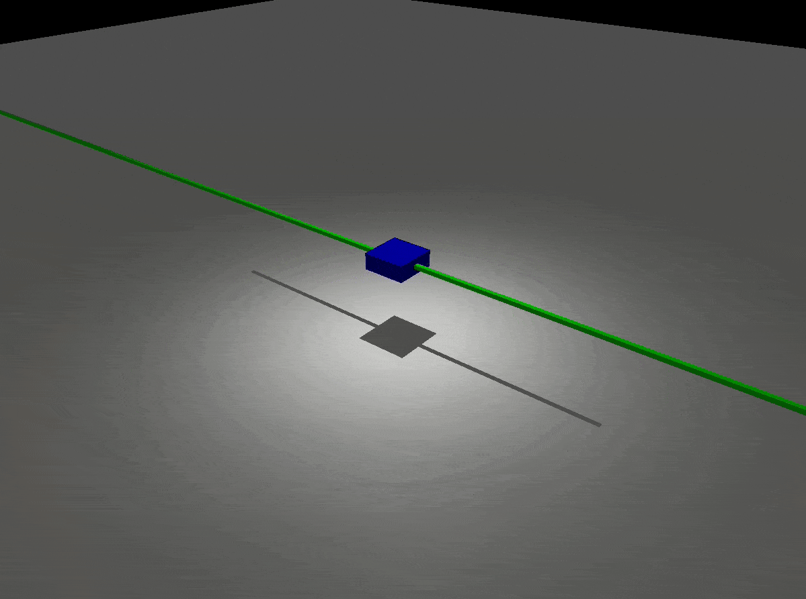
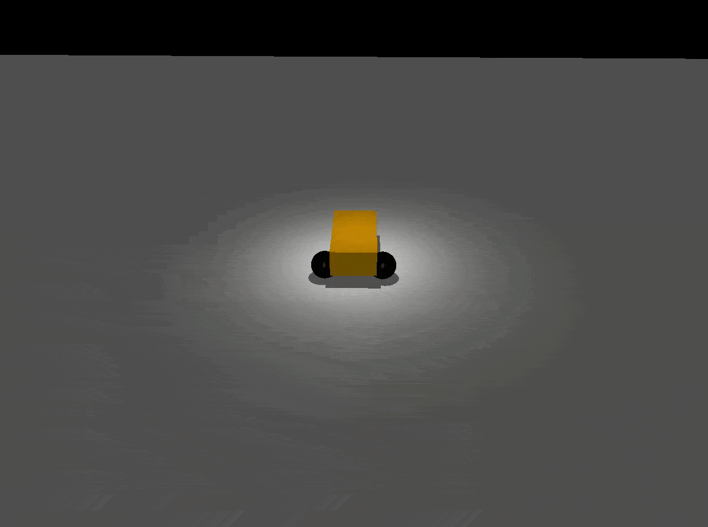

mujoco_ros2_control
=====================
These are the basic examples of using Mujoco with ROS2.

Usage
=====================
ros2_control tag in URDF
--------------------------
Use ``mujoco_ros2_control/MujocoSystem`` for plugin

.. code-block:: xml

  <ros2_control name="MujocoSystem" type="system">
    <hardware>
      <plugin>mujoco_ros2_control/MujocoSystem</plugin>
    </hardware>
    <joint name="slider_to_cart">
      <command_interface name="position">
        <param name="min">-15</param>
        <param name="max">15</param>
      </command_interface>
      <state_interface name="position">
        <param name="initial_value">1.0</param>
      </state_interface>
      <state_interface name="velocity"/>
      <state_interface name="effort"/>
    </joint>
  </ros2_control>

Convert URDF model to xml
--------------------------
You need to convert the URDF model to a MJCF XML file.
Make sure to use the same name for the link and joint, which are mapped to the body and joint in Mujoco.
You need to specify <limit> which is mapped to ``range`` in MJCF. For now, there is no way to specify velocity or acceleration limit.

For force torque sensor, you need to map the sensor to a force sensor and a torque sensor in MJCF since there is no combined force torque sensor in MuJoCo.
The name of each sensor should be ``sensor_name`` + ``_force`` and ``sensor_name`` + ``_torque``.
For example, if you have a force torque sensor called ``my_sensor``, you need to create ``my_sensor_force`` and ``my_sensor_torque`` in MJCF.

Check ``mujoco_ros2_control_demos/mujoco_models`` for examples.

Specify the location of Mujoco models and the controller configuration file
----------------------------------------------------------------------------
You need to pass parameters for paths as shown in the following example.

.. code-block:: python3

  controller_config_file = os.path.join(mujoco_ros2_control_demos_path, 'config', 'cartpole_controller_position.yaml')

  node_mujoco_ros2_control = Node(
      package='mujoco_ros2_control',
      executable='mujoco_ros2_control',
      output='screen',
      parameters=[
          robot_description,
          controller_config_file,
          {'mujoco_model_path':os.path.join(mujoco_ros2_control_demos_path, 'mujoco_models', 'test_cart_position.xml')}
      ]
  )

